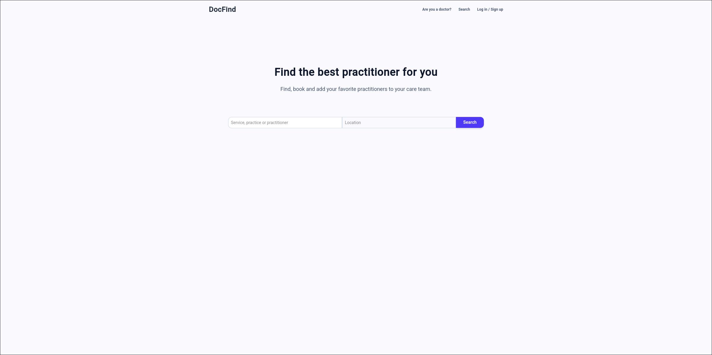
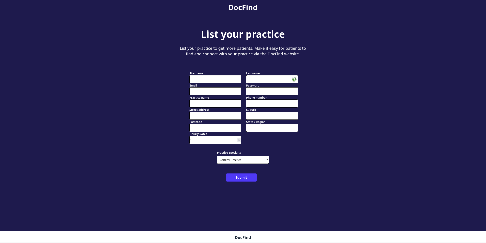

# DocFind

[]() 

*A comprehensive healthcare platform connecting patients with doctors 
seamlessly.*

## 📖 Overview
Docfind is a dual-portal web application designed to bridge the 
gap between medical professionals and patients. The platform allows 
patients to find doctors based on their needs and book appointments, 
while providing doctors with a dedicated dashboard to manage their 
schedules, profiles, and patient interactions.

## 🚀 Features

### 👤 Patient Portal
*   **User Authentication:** Secure Registration and Login system.
*   **Doctor Discovery:** A searchable directory of doctors (filter by 
specialty, location, etc.).
*   **Appointment Booking:** Easy booking flow for selecting time slots.
*   **Booking Management:** A personal dashboard to view, reschedule, or 
cancel upcoming appointments.

### 🩺 Doctor Portal
*   **Professional Profile:** Doctors can set up their profile, 
including specialties, experience, and bio (customizable layout).
*   **Dashboard Management:** View a list of all upcoming bookings from 
patients.
*   **Availability Management:** Control which time slots are available 
for booking.
*   **Profile Customization:** Tools to manage how they appear in the 
search results.

## 🛠 Tech Stack
*   **Frontend:** Angular
*   **Styling:** Tailwind CSS / Material UI
*   **Backend:** C# .NET 9.0 - [here](https://github.com/iohmbmb/docfind-server)
*   **Database:** Sqlite
*   **Authentication:** JWT 

## 📸 Screenshots (Optional)

| Patient Dashboard                  | Doctor Profile Setup              |
| ---------------------------------- | --------------------------------- |
|  |  |
|                                    |                                   |

## ⚙️ Getting Started

### Prerequisites
*   **Node.js** (v24.x or higher recommended)
*   **npm** or **yarn**
*   **Angular CLI** (Optional, but recommended: `npm install -g 
@angular/cli`)

### Installation
1.  **Clone the repository:**
    ```bash
    git clone https://github.com/iohmbmb/docfind-client.git
    ```
2.  **Navigate to the project directory:**
    ```bash
    cd docfind-client
    ```
3.  **Install dependencies:**
    ```bash
    npm install
    # OR if using yarn
    yarn install
    ```

### 🛠 Configuration (Required)
Since this is a frontend-only repository, you need to configure the 
environment variables to connect it to your backend API. 

Because local environment files are excluded from the repo for security, 
you need to update your configuration:

1.  Navigate to `src/environments/`.
2.  Create the file `environment.development.ts`.
3.  Add the following configuration (replace the values with your local 
backend info):

```typescript
export const environment = {
  production: false,
  apiUrl: 'http://localhost:7173/api', 
  patientPortalUrl: 'http://localhost:4200',
  practicePortalUrl: 'http://localhost:4300',
  mapBoxAPI: 'https://api.mapbox.com/search/geocode/v6/forward?q=',
  mapBoxToken: ''
};
```

The mapbox token can obtain by creating a [mapbox account](https://account.mapbox.com/auth/signup/?page=/).

4.  **Run the application:**
    ```bash
    ng serve
    # Or if not using global Angular CLI:
    npm start
    ```

## 🛣 Roadmap
- [ ] Add a "Reminder" system (Email/SMS notifications).
- [ ] Implement a Video Consultation feature.
- [ ] Add an admin panel to verify doctor credentials.
- [ ] Multi-language support.

## 🤝 Contributing
Contributions are welcome! Please follow these steps:
1. Fork the Project.
2. Create your Feature Branch (`git checkout -b 
feature/AmazingFeature`).
3. Commit your Changes (`git commit -m 'Add 
some AmazingFeature'`).
4. Push to the Branch (`git push origin feature/AmazingFeature`).
5. Open a Pull Request.

## 📄 License
Distributed under the [MIT] License. See `LICENSE` for more information.

## 📧 Contact
Ioh - iohannes.mboumba@pm.me

Project Link: 
[https://github.com/iohmbmb/docfind-client](https://github.com/iohmbmb/docfind-client)
